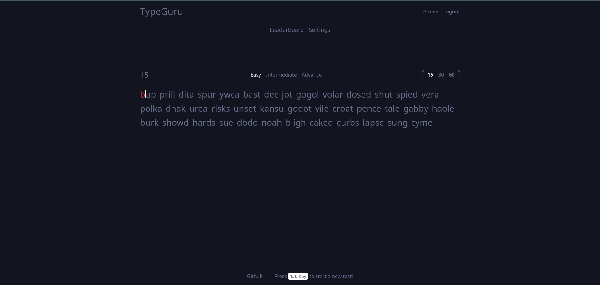

# TypeGuru

#### Video Demo:

#### Description: TypeGuru: Become the better typist you desire

Welcome to TypeGuru, a specialized web application designed to help those looking to learn the art of touch typing and help improve the skill of those already typing.

## Table of Contents

- [Getting Started](#getting-started)
- [Introduction](#introduction)
- [Features](#features)
- [Technologies Used](#technologies-used)
- [Installation](#installation)
- [Folder Structure](#folder-structure)
- [Usage](#usage)
- [License](#license)
- [Contact](#contact)

### Getting Started

To begin utilizing TypeGuru, start by creating an account and explore the [Usage](#usage) section. Start capturing, organizing, and enhancing your typing skills with TypeGuru.

## Introduction

TypeGuru is a simple web application tailored to help users improve their typing skills. Whether you're a beginner looking to learn touch typing or an experienced typist aiming to enhance your speed and accuracy, TypeGuru offers a platform to achieve your typing goals.



## Features

Below are the key features of TypeGuru:

- **User Authentication:** Securely sign up and sign in to your TypeGuru account.
- **Track Typing Progress:** Monitor your typing speed (WPM) and accuracy while practicing typing exercises.
- **Multiple Typing Modes:** Practice typing in different modes to improve your skills.
- **Customize Difficulty Levels:** Adjust the difficulty level of typing exercises to match your proficiency.
- **Record Keeping:** Keep track of your typing performance and see your progress over time.
- **Responsive Design:** Enjoy a seamless experience across devices, from desktop to mobile.

### Technologies Used

List the key technologies, frameworks, and libraries that your project utilizes.

<div style="display: flex; justify-content: center; align-items: baseline; gap: 20px;">
    
</div>

### Installation

Kindly check the [CONTRIBUTING.md](CONTRIBUTING.md) file on how to install, run and contribute to the project

- #### Folder Structure

  ```
  project-root/
  │
  ├── capstone/
  │ ├── asgi.py
  │ ├── settings_dev.py
  │ ├── settings_pro.py
  │ ├── settings.py
  │ ├── urls.py
  │ ├── wsgi.py
  │ └── ...
  │
  ├── static/
  │ ├── css.js
  │ ├── favicon.ico
  │ ├── signup.js
  │ ├── styles.css
  │ └── ...
  │
  ├── typeguru/
  │ ├── migrations
  │ ├── static
  │ │  ├── dictionary
  │ │  ├── typeguru
  │ │  └── ...
  │ ├── templates
  │ │   ├── typeguru
  │ │   └── ...
  │ ├── __init___.py
  │ ├── admin.py
  │ ├── apps.py
  │ ├── models.py
  │ ├── tests.py
  │ ├── urls.py
  │ ├── views.py
  │ └── ...
  │
  ├── .gitignore
  ├── build_files.sh
  ├── CONTRIBUTING.md
  ├── LICENSE
  ├── manage.py
  ├── package.json
  ├── postcss.json
  ├── README.md
  ├── requirements.txt
  ├── tailwind.config.js
  ├── vercel.json
  └── ...
  ```

## Usage

Discover how to make the most of TypeGuru's features. Learn how to practice touch typing, improve your typing speed, and track your progress effectively.

- ### Usage Flow

Sign Up: Begin your TypeGuru experience by signing up for an account. Provide your email and create a secure password to start.

- Sign up to save progress on TypeGuru.
- Sign in with your credentials.
- Explore the typing exercises to practice.
- Monitor your typing speed and accuracy.
- Track your typing progress.

## License

TypeGuru is licensed under the [MIT License](LICENSE).

## Contact

For any inquiries or feedback, reach out to me via [email](mailto:babsman4all@email.com).
